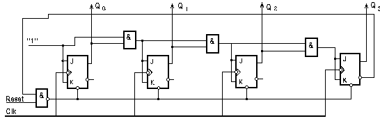
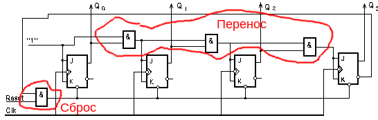
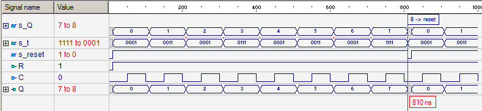

### Синхронный суммирующий счетчик на JK-триггерах с коэффициентом пересчета 8

#### Формулировка задачи
Построить структурную HDL–модель счетной структуры элементарных автоматов.
Суммирующий синхронный счетчик на JK–триггерах c коэфф. пересчета 8.

#### Формализация задачи
Счетчик должен иметь такие порты:
- синхровход C;
- сигнал сброса R;
- выход Q, текущее значение счетчика.

В диапазоне от 0 до 7-ми счетчик считает в естественном режиме, 
при достижении значения "8" (1000) должен происходить сброс в 0.

Тип синхронизации в исходном задании не указан.

Базовым для реализации является JK-триггер. Используем JK-триггер 
с синхронизацией по заднему фронту и входом асинхронного сброса R.

Задержку срабатывания триггера установим в `10 ns`;

#### Интерфейс

#### Ход реализации
Необходимо составить структурную VHDL-модель счетчика. Для этого 
необходимо предварительно составить структурную схему устройства, 
определить базовые компоненты и внутренние линии, составить VHDL-
модели базовых компонентов и структурную модель верхнего уровня 
иерархии (счетчика).

Структурная схема счетчика:

Как видим, синхронный суммирующий счетчик состоит из:
- запоминающих элементов (триггеров);
- комбинационных схем, которые отвечают за формирование переноса 
  (в коде - `and1`, `and2`, `and3`);
- комбинационной схемы, которая производит сброс при переполнении 
  счетчика (в коде - `and_reset`; сброс при при значении счетчика 
  большем, чем семь).
  

Код - в этой папке репозитория.

Закон функционирования JK-триггера: SimTEST, ЛБ 9.

#### Верификация
Верификация - проверка модели на соответствие спецификации.

Для верификации необходимо проверить:
- возможность асинхронного сброса в 0 по активному сигналу на входе `R`;
- работу счетчика в обычном режиме, счет от 0 до 7;
- наличие сброса при превышении максимального значения (8).

Временная диаграмма работы счетчика:

